# Text-to-SQL Agent

用自然语言查询任意数据库。输入问题，Agent 自动生成 SQL、执行查询、解释结果，并支持通过示例训练持续提升准确率。

---

## 系统架构

```mermaid
graph TB
    subgraph Browser["🌐 Browser"]
        subgraph FE["Frontend · React 18 + Vite 6 + Tailwind CSS · :5174"]
            App["App.tsx
            ─────────────────
            全局状态管理
            sessionId · schema
            messages · trainingPairs"]

            subgraph UI["UI Components"]
                CM["ConnectModal
                ──────────────
                数据库类型选择
                连接参数表单
                测试连接"]

                SE["SchemaExplorer
                ──────────────
                表列表 / 列详情
                PK · FK · UNIQUE 标记
                行数统计 · 点击查询"]

                QC["QueryChat
                ──────────────
                消息列表渲染
                自然语言输入框
                快捷提问建议"]

                TP["TrainingPanel
                ──────────────
                训练对列表
                添加 / 删除示例"]
            end

            subgraph MSG["消息渲染层"]
                AM["AssistantMessage
                ──────────────
                解释文本 (Markdown-lite)
                置信度 · 执行耗时"]

                SB["SqlBlock
                ──────────────
                SQL 语法高亮
                数据库类型徽章
                一键复制"]

                RV["ResultView
                ──────────────
                表格 / 图表切换"]

                TV["TableView
                ──────────────
                列排序 · 分页(8行)
                CSV 导出"]

                CV["ChartView · Recharts
                ──────────────
                Bar · Line
                Area · Pie"]
            end

            App --> CM & SE & QC & TP
            QC --> AM
            AM --> SB & RV
            RV --> TV & CV
        end
    end

    subgraph BE["⚙️ Backend · FastAPI + Python 3.11 · :8002"]
        subgraph Routes["main.py — 路由层"]
            R1["POST /api/test-connection"]
            R2["POST /api/connect"]
            R3["POST /api/disconnect"]
            R4["POST /api/query"]
            R5["GET  /api/training"]
            R6["POST /api/training"]
            R7["DELETE /api/training/{id}"]
        end

        subgraph Config["配置层"]
            Cfg["config.py · Pydantic Settings
            ──────────────
            ANTHROPIC_API_KEY
            SQL_MODEL · EXPLAIN_MODEL
            EMBEDDING_BACKEND
            ST_MODEL_NAME
            CHROMA_PATH · SQLITE_PATH
            MAX_RESULT_ROWS(500)
            MAX_QUERY_PREVIEW_ROWS(20)"]

            Mdl["models.py · Pydantic Models
            ──────────────
            DbConfigRequest
            DbSchema · TableInfo · ColumnInfo
            QueryRequest · QueryResponse
            ChartDataPoint
            TrainingPair · TrainingPairCreate"]
        end

        subgraph DBLayer["db/ — 数据库层"]
            Conn["connector.py
            ──────────────
            _sessions: dict[str, Engine]
            ─ 凭据仅存内存，不落盘 ─
            postgresql+psycopg2
            mysql+pymysql
            sqlite:///
            clickhouse+http
            test · create · get · close"]

            Insp["introspector.py
            ──────────────
            SQLAlchemy inspect(engine)
            get_table_names()
            get_columns()
            get_pk_constraint()
            get_foreign_keys()
            get_unique_constraints()
            SELECT COUNT(*) per table"]
        end

        subgraph AgentLayer["agent/ — AI 推理层"]
            Pipe["pipeline.py · 主编排器
            ──────────────
            ① vector.search(q, n=3)
            ② build_system_prompt(schema)
            ③ build_few_shot(pairs)
            ④ llm.generate_sql(...)
            ⑤ 去除 markdown 代码围栏
            ⑥ 安全校验
            ⑦ engine.execute(sql)
            ⑧ llm.explain_result(...)
            ⑨ _infer_chart(sql)
            ⑩ _build_chart_data(cols,rows)"]

            PB["prompt_builder.py
            ──────────────
            schema_to_text()
              → PK/FK/UNIQUE/nullable
            build_system_prompt()
              → 数据库类型 + Schema
            build_few_shot()
              → Q: … / SQL: … 格式
            build_explain_prompt()
              → SQL + 前20行数据"]

            LLM["llm.py · Anthropic 封装
            ──────────────
            generate_sql()
              model: claude-sonnet-4-6
              temperature: 0
              max_tokens: 1024
            explain_result()
              model: claude-haiku-4-5-20251001
              temperature: 0.3
              max_tokens: 400"]

            Safe["Safety Gate
            ──────────────
            _ALLOWED_PATTERN
              ^\s*SELECT\b
            _FORBIDDEN
              INSERT · UPDATE · DELETE
              DROP · ALTER · TRUNCATE
              CREATE · REPLACE · MERGE
              EXEC · EXECUTE
            → 非 SELECT 一律拦截"]
        end

        subgraph TrLayer["training/ — 训练层"]
            Store["store.py · SQLite CRUD
            ──────────────
            list_pairs()
            add_pair() → uuid4 id
            delete_pair()
            get_pair()
            表: training_pairs
              id · question · sql
              notes · created_at"]

            Vec["vector.py · ChromaDB
            ──────────────
            PersistentClient
            collection: training_pairs
            hnsw:space = cosine
            SentenceTransformerEmbeddingFunction
            upsert(id, question)
            delete(id)
            search(q, n=3) → [ids]"]
        end

        SchCache["_schema_cache
        ──────────────
        dict[sessionId → DbSchema]
        In-Memory · 避免重复 introspect"]

        R2 --> Conn & Insp & SchCache
        R3 --> Conn
        R4 --> Pipe & SchCache
        R5 --> Store
        R6 --> Store & Vec
        R7 --> Store & Vec
        Pipe --> PB & LLM & Safe & Vec & Store
    end

    subgraph Storage["💾 Local Storage"]
        MemSess[("In-Memory
        Session Registry
        dict[sessionId → Engine]
        ⚡ 进程重启即失效")]

        Chroma[("ChromaDB
        ./data/chroma/
        HNSW cosine 索引
        持久化向量")]

        SQLiteFile[("SQLite
        ./data/training.db
        training_pairs
        持久化元数据")]
    end

    subgraph Ext["☁️ External"]
        Claude["Anthropic Claude API
        ──────────────
        claude-sonnet-4-6
        claude-haiku-4-5-20251001"]

        ST["SentenceTransformers
        ──────────────
        paraphrase-multilingual
        -MiniLM-L12-v2
        本地离线运行"]

        TDB[("Target Database
        ──────────────
        MySQL (pymysql)
        PostgreSQL (psycopg2)
        SQLite
        ClickHouse (http)")]
    end

    %% Frontend ↔ Backend
    CM -->|"POST /api/test-connection"| R1
    CM -->|"POST /api/connect"| R2
    App -->|"POST /api/disconnect"| R3
    QC -->|"POST /api/query + sessionId"| R4
    TP -->|"GET · POST · DELETE /api/training"| R5 & R6 & R7

    %% Backend → Storage
    Conn --> MemSess
    Vec --> Chroma
    Vec -->|"embed question"| ST
    Store --> SQLiteFile

    %% Backend → External
    LLM --> Claude
    Conn & Insp & Pipe -->|"SQLAlchemy execute"| TDB
```



---

## 查询管道详细流程

```mermaid
flowchart TD
    A(["用户在 QueryChat 输入问题"]) --> B

    B["POST /api/query
    ─────────
    { question, sessionId }"]

    B --> C{"sessionId
    在内存中?"}
    C -->|"否"| ERR1(["❌ 404 Session not found\n请重新连接"])
    C -->|"是"| D

    D["从 _schema_cache 取 DbSchema
    ─────────
    表结构 / 列信息 / 类型"]

    D --> E

    subgraph Step1["① Few-shot 检索"]
        E["vector.search(question, n=3)
        ─────────
        SentenceTransformers 向量化问题
        ChromaDB cosine 相似度检索
        返回 top-3 训练对 ID"]

        E --> F["store.get_pair(id) × 3
        ─────────
        SQLite 查询训练对详情
        { question, sql, notes }"]
    end

    subgraph Step2["② Prompt 构建"]
        F --> G["prompt_builder.build_system_prompt(schema)
        ─────────
        数据库类型说明
        完整 Schema 文本
        PK / FK / UNIQUE / nullable 标注"]

        G --> H["prompt_builder.build_few_shot(pairs)
        ─────────
        Q: 示例问题1
        SQL: SELECT ...
        Q: 示例问题2
        SQL: SELECT ..."]
    end

    subgraph Step3["③ SQL 生成"]
        H --> I["llm.generate_sql()
        ─────────
        model: claude-sonnet-4-6
        temperature: 0
        max_tokens: 1024
        system: schema + 规则
        user: few-shot + Q: 问题\nSQL:"]

        I --> J["去除 Markdown 代码围栏
        ─────────
        ```sql ... ``` → 纯 SQL 文本"]
    end

    subgraph Step4["④ 安全校验"]
        J --> K{"Safety Gate"}
        K -->|"非 SELECT\n或含危险关键字"| ERR2(["❌ 安全拦截
        非 SELECT 操作已阻止"])
        K -->|"通过"| L
    end

    subgraph Step5["⑤ SQL 执行"]
        L["SQLAlchemy engine.connect()
        ─────────
        text(sql)
        fetchmany(max_result_rows=500)
        返回 columns · rows · rowCount"]
        L --> M{"执行成功?"}
        M -->|"否"| ERR3(["❌ SQL 执行失败
        返回错误信息"])
        M -->|"是"| N
    end

    subgraph Step6["⑥ 结果解释"]
        N["prompt_builder.build_explain_prompt()
        ─────────
        原始问题 + SQL + 前20行数据"]

        N --> O["llm.explain_result()
        ─────────
        model: claude-haiku-4-5-20251001
        temperature: 0.3
        max_tokens: 400
        输出: 中文自然语言分析"]
    end

    subgraph Step7["⑦ 图表推断"]
        O --> P["_infer_chart(sql_lower, columns)
        ─────────
        含 date/month/year/time → area
        含 pct/percent/ratio → pie
        含 GROUP BY → bar
        否则 → None (仅表格)"]

        P --> Q["_build_chart_data(columns, rows)
        ─────────
        col[0] → name
        col[1] → value (float)
        col[2] → value2 (可选)
        最多取前20行"]
    end

    subgraph Step8["⑧ 置信度计算"]
        Q --> R["confidence =
        0.95 − max(0, (3 − len(pairs)) × 0.08)
        ─────────
        命中3对 → 0.95
        命中2对 → 0.87
        命中1对 → 0.79
        命中0对 → 0.71"]
    end

    R --> S["返回 QueryResponse
    ─────────
    sql · explanation · columns
    rows · rowCount · confidence
    executionTime · chartType · chartData
    isError · errorMessage"]

    S --> T["前端渲染 AssistantMessage
    ─────────
    explanation → dangerouslySetInnerHTML
    sql → SqlBlock 语法高亮
    queryResult → ResultView
    chartData → ChartView (Recharts)"]
```



---

## 技术栈

| 层次 | 技术 | 版本 |
| --- | --- | --- |
| 前端框架 | React | 18.3 |
| 构建工具 | Vite | 6.3 |
| 样式 | Tailwind CSS | 4.1 |
| 动画 | Motion (Framer) | 12 |
| 图表 | Recharts | 2.15 |
| 后端框架 | FastAPI | 0.115 |
| ORM | SQLAlchemy | 2.0 |
| LLM | Anthropic Claude | claude-sonnet-4-6 · claude-haiku-4-5-20251001 |
| 向量数据库 | ChromaDB | 0.5 |
| Embedding | SentenceTransformers | 3.3 |
| 训练对存储 | SQLite | — |
| 数据库驱动 | psycopg2 · PyMySQL · clickhouse-sqlalchemy | — |

---

## 本地运行

### 1. 后端

```bash
cd backend
python -m venv .venv && source .venv/bin/activate
pip install -r requirements.txt
cp .env.example .env        # 填入 ANTHROPIC_API_KEY
uvicorn main:app --port 8002 --reload
```

### 2. 前端

```bash
npm install
npm run dev                 # 默认 :5173，端口占用自动切换
```

### 3. 测试数据库（Docker MySQL）

```bash
docker run -d --name texttosql-test-db \
  -e MYSQL_ROOT_PASSWORD=root123 \
  -e MYSQL_DATABASE=ecommerce_db \
  -e MYSQL_USER=agent \
  -e MYSQL_PASSWORD=agent123 \
  -p 3307:3306 mysql:8.0
```

连接参数：`host=127.0.0.1 port=3307 database=ecommerce_db user=agent password=agent123`
